# Oil and Gas Pipeline Monitoring with LightningChart Python

## Introduction
In the fast-evolving world of the energy industry, oil and gas data analysis has emerged as a critical factor in shaping the future of energy management and sustainability. By leveraging data analytics, companies can enhance operational efficiency, optimize resource allocation, and make informed decisions to address the unique challenges in oil and gas exploration and production. (Positioning for Green, n.d.)

Oil and gas analytics serve numerous purposes across the lifecycle of energy production. For instance, predictive maintenance models allow operators to forecast equipment failures, reducing unexpected downtimes and maintenance costs. Furthermore, data analysis in the oil and gas sector provides insights for optimizing operations, reducing environmental impacts, and ensuring safety, especially in managing pipelines—where monitoring plays a crucial role in detecting leaks and preventing spills. (Hussain et al., 2023)

## Big Data in the Oil and Gas Industry
The oil and gas industry is inherently data-intensive, with vast amounts of information generated daily across upstream, midstream, and downstream operations. Big data enables companies to analyze patterns in seismic, drilling, and production data, helping streamline processes from exploration to transportation.

In upstream operations, analytics assist in reservoir simulation and well performance monitoring. In midstream and downstream, data analysis aids in tracking transportation logistics, optimizing pipeline flow, and refining processes. Real-time data streaming, combined with historical analysis, enables proactive pipeline monitoring—minimizing operational risks, reducing environmental hazards, and optimizing maintenance schedules.

## LightningChart Python

### Overview of LightningChart Python
LightningChart Python is a high-performance data visualization library, designed to handle large datasets efficiently and render complex, interactive visualizations. Ideal for oil and gas data analysis, it supports a wide range of charts including line charts, heatmaps, spider charts, and real-time dashboards, allowing users to visualize and interpret data effectively. (LightningChart Python API Reference, n.d.)

### Features and Chart Types to be Used in the Project
LightningChart Python provides a suite of powerful features that are particularly beneficial for visualizing oil and gas data. Some of the chart types used in our analysis include:

**Point Line Chart**:

A line chart with points marked on the line, ideal for tracking changes over time, such as monthly trends in pipeline incidents. It shows both the direction and magnitude of change clearly.

**Stacked Bar Chart**:
  
A bar chart where categories are stacked on top of each other, allowing for the comparison of parts to the whole. For example, it can show incidents by liquid type or pipeline type, helping to see category distributions within the total incidents.

**Horizontal Bar Chart**:

Similar to a bar chart but oriented horizontally, useful for comparing categories with longer labels or when the focus is on ranking items, such as causes of pipeline incidents. It helps highlight the top causes of incidents.

**Heatmap**:

A visual representation of data intensity over geographic or other two-dimensional spaces using color gradients. It’s effective for identifying high-risk zones in pipeline networks by location, with colors indicating incident density.

**Radar Chart**:

A circular chart that displays multiple variables on axes starting from the same point, ideal for comparing metrics like incident frequency, recovery rates, and costs over time. It provides an overview of multiple metrics in one chart.

**Dual Axis Chart**:

A chart with two y-axes, often used to compare two related metrics on different scales, such as net loss and total costs. It allows for simultaneous visualization of two datasets, revealing their relationship or trend alignment.

**Bubble Chart**:

A scatter plot where the size of the points (bubbles) represents an additional variable, such as cost impact. Useful for showing the severity of incidents by month, where larger bubbles indicate higher costs or severity.

**Line Chart**:

A basic chart for showing trends over time, such as monthly costs for different categories. It helps track how variables change, making it easier to see trends or cycles over a period.

**Stacked Area Chart**:

An area chart that stacks multiple data series on top of each other, providing a cumulative view of the total and its components. It’s suitable for visualizing total impact over time, such as incident metrics across several years.

**Box Plot**:

A statistical chart that displays the distribution of data through quartiles, including median and outliers. Useful for identifying seasonal cost variations, it provides insights into data spread and any potential seasonal spikes.

**Gauge Chart**:

A circular chart that resembles a speedometer, showing a single value within a range. It’s used to display metrics like liquid recovery as a percentage of net loss, providing a quick visual assessment of performance relative to a goal.

These chart types enable analysts to monitor, predict, and mitigate potential pipeline issues effectively, enhancing safety and optimizing resource allocation.

### Performance Characteristics
Designed for handling large datasets, LightningChart Python offers smooth performance without compromising on speed or detail. This high-performance rendering makes it suitable for real-time monitoring, where quick response times are essential. LightningChart's ability to handle complex data structures and high-volume datasets efficiently is a significant advantage for the oil and gas industry.

## Setting Up Python Environment

### Installing Python and Necessary Libraries
To get started, ensure you have Python installed. Install the following libraries:
```bash
pip install lightningchart==0.9.0
pip install numpy pandas statsmodels
```

### Overview of Libraries Used
- **lightningchart**: This package provides high-performance charting capabilities.
- **numpy**: Essential for numerical operations in Python.
- **pandas**: Used for data manipulation and analysis.
- **Scikit-Learn**: For predictive modeling and machine learning applications.

### Setting Up Your Development Environment
1. Set up a virtual environment to keep dependencies isolated and manageable.
 
  ```bash
   python3 -m venv venv
   source venv/bin/activate  # On Windows use `venv\Scripts\activate`
   pip install -r requirements.txt
   ```

2. Use Visual Studio Code (VSCode) for efficient coding and project management.

## Loading and Processing Data

### Loading the Data Files
To load the dataset containing information on oil pipeline incidents, use Pandas.

```python
import pandas as pd
file_path = 'Dataset/database.csv'
data = pd.read_csv(file_path)
```

### Handling and Preprocessing the Data
Transform date columns into datetime objects, handle missing values, and normalize numerical columns if necessary.

```python
data['Accident Date/Time'] = pd.to_datetime(data['Accident Date/Time'])
data.dropna(inplace=True)
```

These preprocessing steps are crucial for efficient data visualization and accurate predictive modeling.

## Visualizing Data with LightningChart

### Introduction to LightningChart for Python
With LightningChart, visualizing oil and gas data becomes highly interactive and insightful. Let's explore creating some key visualizations that provide actionable insights into pipeline monitoring.

### Creating the Charts

### **Monthly Incident Frequency Line Chart**: 

This line chart highlights the monthly trend of oil pipeline incidents from 2010 to 2017, showing fluctuations in incident frequency. Peaks and troughs in the chart suggest seasonality or operational changes impacting incidents.

#### Script Summary:
```python
data['year_month'] = pd.to_datetime(data['Accident Date/Time']).dt.to_period('M')
monthly_incidents = data.groupby('year_month').size().reset_index(name='incident_count')
x_values = (monthly_incidents['year_month'].dt.start_time.astype('int64') // 10**6).tolist()
y_values = monthly_incidents['incident_count'].tolist()

chart = lc.ChartXY(theme=lc.Themes.Dark, title='Monthly Incidents of Oil Pipeline Leaks and Spills')
chart.get_default_x_axis().set_title('Month').set_tick_strategy('DateTime', time_origin=min(x_values) // 1000)
chart.get_default_y_axis().set_title('Number of Incidents')

chart.add_point_line_series(data_pattern='ProgressiveX').set_point_size(8).set_point_shape
('Triangle').set_point_color(lc.Color('orange')).add(x_values, y_values)
chart.open()
```
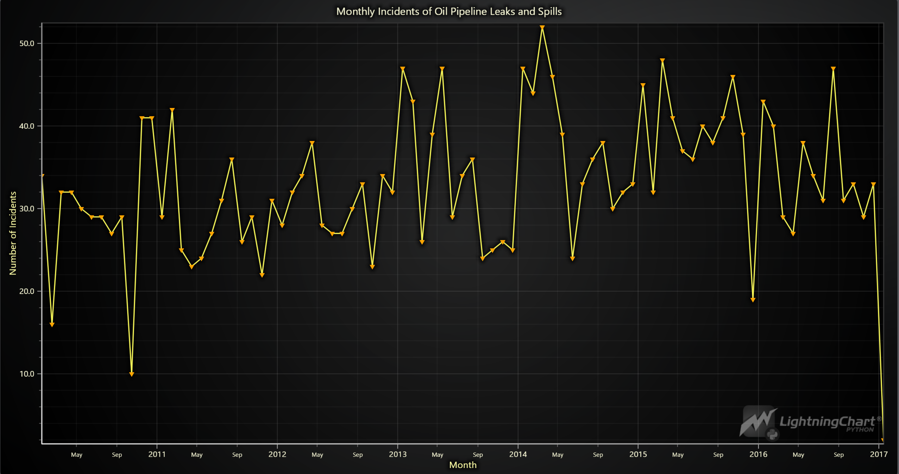

### **Pipeline Incidents by Liquid Type (Stacked Bar Chart)**: 

This stacked bar chart categorizes pipeline incidents by liquid type (e.g., crude oil, refined products), showing that crude oil has the highest incident frequency, indicating a need for targeted safety efforts.

#### Script Summary:
```python
data['Year'] = pd.to_datetime(data['Accident Date/Time']).dt.year.astype(str)
categories = ['Pipeline Type', 'Liquid Type']

chart = lc.BarChart(vertical=True, theme=lc.Themes.Light, title='Incident Frequency by Category Over the Years')
chart.set_sorting('alphabetical').set_value_label_display_mode('hidden').set_label_rotation(45).add_legend()

for category in categories:
    category_year_data = data.dropna(subset=[category]).groupby(['Year', category]).size().unstack(fill_value=0)
    x_values = category_year_data.index.tolist()
    stacked_data = [{'subCategory': sub, 'values': category_year_data[sub].tolist()} for sub in category_year_data.columns]
    chart.set_data_stacked(x_values, stacked_data).set_title(f'Incident Frequency by {category} Over the Years')
    chart.open()

```
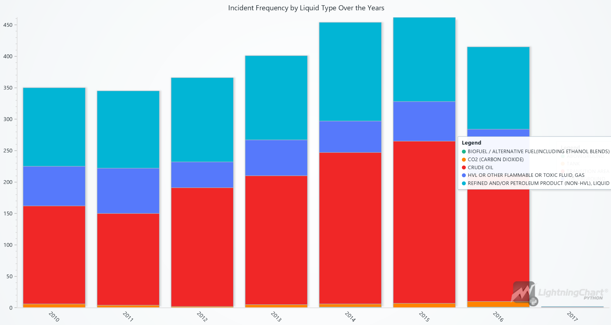

### **Pipeline Incidents by Pipeline Type (Stacked Bar Chart)**: 

This chart categorizes incidents by pipeline type (e.g., aboveground, underground) for each year, revealing higher incident rates in underground and aboveground pipelines, highlighting where more frequent monitoring is needed.

#### Script Summary:
```python
data['Year'] = pd.to_datetime(data['Accident Date/Time']).dt.year.astype(str)
categories = ['Pipeline Type', 'Liquid Type']

chart = lc.BarChart(vertical=True, theme=lc.Themes.Light, title='Incident Frequency by Category Over the Years')
chart.set_sorting('alphabetical').set_value_label_display_mode('hidden').set_label_rotation(45).add_legend()

for category in categories:
    category_year_data = data.dropna(subset=[category]).groupby(['Year', category]).size().unstack(fill_value=0)
    x_values = category_year_data.index.tolist()
    stacked_data = [{'subCategory': sub, 'values': category_year_data[sub].tolist()} for sub in category_year_data.columns]
    chart.set_data_stacked(x_values, stacked_data).set_title(f'Incident Frequency by {category} Over the Years')
    chart.open()
```
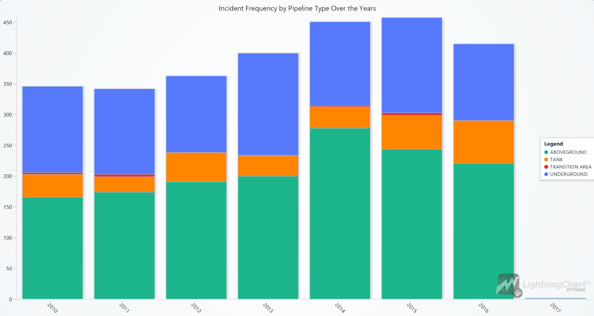

### **Cause of Pipeline Incidents (Horizontal Bar Chart)**: 

This chart ranks incident causes, showing "Internal" as the top cause. Identifying primary causes allows companies to mitigate risks by improving internal processes.

#### Script Summary:
```python
data = pd.read_csv('Dataset/database.csv')
cause_counts = data['Cause Subcategory'].value_counts()
chart_data = [{'category': cause, 'value': int(count)} for cause, count in zip(cause_counts.index, cause_counts.values)]

chart = lc.BarChart(vertical=True, theme=lc.Themes.White, title='Cause Subcategory Counts')
chart.set_sorting('disabled').set_label_rotation(90).set_data(chart_data)
chart.open()
```
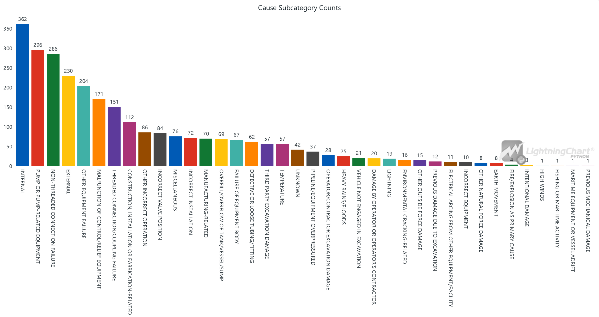

### **Incident Costs by State (Bar Chart)**: 

Displays total costs of incidents by state, providing insights into high-cost areas that may require additional monitoring and resources.

#### Script Summary:
```python
data = pd.read_csv('Dataset/database.csv')
state_costs = data.groupby('Accident State')['All Costs'].sum().sort_values(ascending=False)
chart_data = [{'category': state, 'value': int(cost)} for state, cost in zip(state_costs.index, state_costs.values)]

chart = lc.BarChart(vertical=True, theme=lc.Themes.White, title='Total Costs by State')
chart.set_sorting('descending').set_label_rotation(90).set_data(chart_data).set_value_label_font_size(10)
chart.open()
```
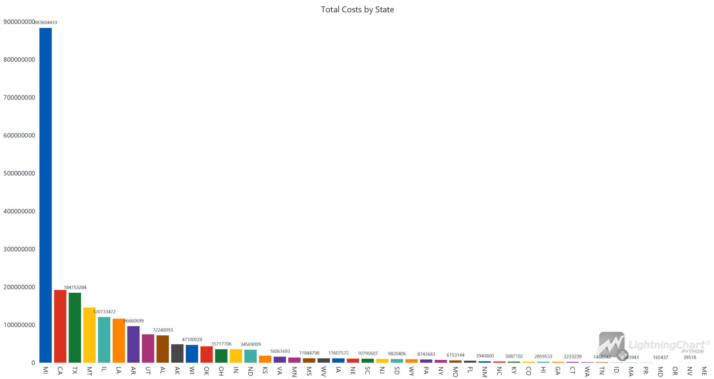

### **Pipeline Spills and Leaks by Location (Heatmap)**: 

Shows geographic distribution of spills, with red areas indicating high-risk zones. This helps prioritize locations for safety checks.

#### Script Summary:
```python
data = pd.read_csv('Dataset/database.csv')
latitude, longitude = data['Accident Latitude'].dropna(), data['Accident Longitude'].dropna()
incident_density, lon_edges, lat_edges = np.histogram2d(longitude, latitude, bins=[100, 100])

chart = lc.ChartXY(title='Geospatial Analysis of Oil Pipeline Spills and Leaks', theme=lc.Themes.Dark)
heatmap = chart.add_heatmap_grid_series(rows=incident_density.shape[0], columns=incident_density.shape[1])

heatmap.set_start(x=lon_edges.min(), y=lat_edges.min()).set_end(x=lon_edges.max(), y=lat_edges.max())
heatmap.invalidate_intensity_values(incident_density.tolist())

custom_palette = [
    {"value": np.min(incident_density), "color": lc.Color(204, 229, 255)},
    {"value": np.percentile(incident_density, 99), "color": lc.Color(0, 0, 255)},
    {"value": np.percentile(incident_density, 99.25), "color": lc.Color(0, 255, 255)},
    {"value": np.percentile(incident_density, 99.5), "color": lc.Color(0, 255, 0)},
    {"value": np.percentile(incident_density, 99.75), "color": lc.Color(255, 255, 204)},
    {"value": np.max(incident_density), "color": lc.Color(255, 0, 0)}
]
heatmap.set_palette_colors(steps=custom_palette, look_up_property='value', interpolate=True)

chart.get_default_x_axis().set_title('Longitude')
chart.get_default_y_axis().set_title('Latitude')
chart.add_legend(data=heatmap, title="Incident Density")
chart.open()
```
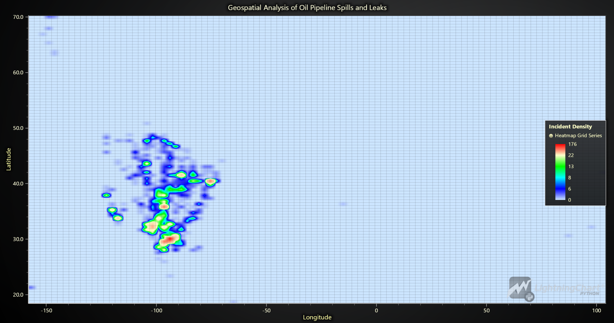

### **Comparison of Key Metrics by Year (Radar Chart)**: 

Compares various metrics—incident counts, liquid recovery, net loss, and costs—across years, helping to identify yearly variations in key metrics.

#### Script Summary:
```python
data = pd.read_csv('Dataset/database.csv')
data['Year'] = pd.to_datetime(data['Accident Date/Time']).dt.year

aggregated_data = data.groupby('Year').agg({
    'Accident Year': 'count',
    'Liquid Recovery (Barrels)': 'mean',
    'Net Loss (Barrels)': 'mean',
    'All Costs': 'mean'
}).reset_index()
scaled_data = aggregated_data.copy()
metrics = ['Incidents', 'Average Liquid Recovery', 'Average Net Loss', 'All Costs']

for metric in metrics:
    min_val, max_val = scaled_data[metric].min(), scaled_data[metric].max()
    scaled_data[metric] = (scaled_data[metric] - min_val) / (max_val - min_val) * 10  

chart = lc.SpiderChart(theme=lc.Themes.White, title='Pipeline Incident Impact Metrics Over Time')
chart.set_axis_label_font(weight='bold', size=15).set_nib_style(thickness=5, color=lc.Color(0, 0, 0))

for metric in metrics:
    chart.add_axis(metric)

for _, row in scaled_data.iterrows():
    chart.add_series().set_name(f"Year {int(row['Year'])}").add_points(
        [{'axis': metric, 'value': row[metric]} for metric in metrics])

chart.add_legend()
chart.open()
```
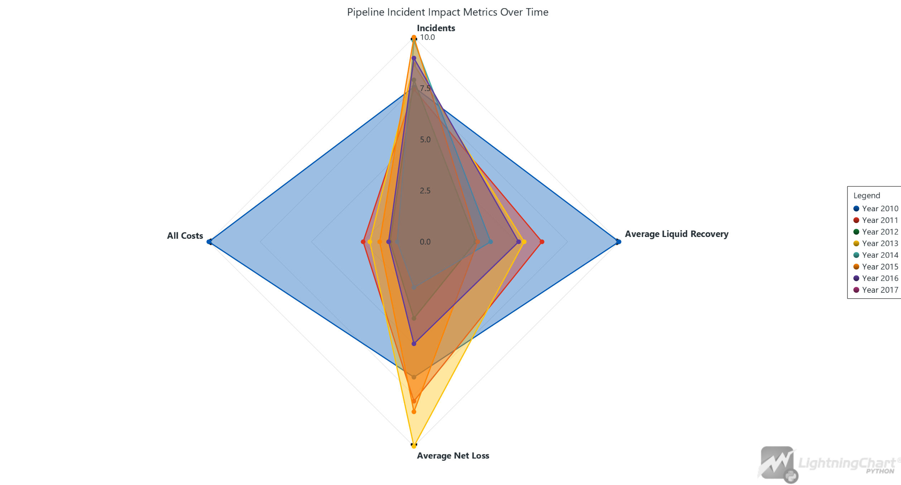

### **Net Loss vs. Total Costs (Dual Axis Chart)**: 

Illustrates the relationship between net loss and costs, showing a trend alignment that helps in predicting cost implications.

#### Script Summary:
```python
data = pd.read_csv('Dataset/database.csv')
data['Accident Date/Time'] = pd.to_datetime(data['Accident Date/Time'])
data['year'] = data['Accident Date/Time'].dt.year

annual_data = data.groupby('year').agg({'Net Loss (Barrels)': 'sum', 'All Costs': 'sum'}).reset_index()

chart = lc.ChartXY(theme=lc.Themes.Dark, title="Annual Net Loss (Barrels) vs Total Costs (USD)")
y_axis_loss, y_axis_costs = chart.get_default_y_axis(), chart.add_y_axis(opposite=True)
y_axis_loss.set_title("Net Loss (Barrels)")
y_axis_costs.set_title("Total Costs (USD)")

series_loss = chart.add_area_series().set_name('Net Loss').set_fill_color(lc.Color(255, 102, 102))
series_costs = chart.add_point_line_series(y_axis=y_axis_costs).set_name('Total Costs').set_point_shape(
    'triangle').set_line_thickness(2).set_line_color(lc.Color(255, 255, 0))

x_values = [int(datetime(year, 1, 1).timestamp()) * 1000 for year in annual_data['year']]
series_loss.add(x=x_values, y=annual_data['Net Loss (Barrels)'].tolist())
series_costs.add(x=x_values, y=annual_data['All Costs'].tolist())

x_axis = chart.get_default_x_axis().set_title('Year').set_tick_strategy('DateTime', utc=True)
y_axis_loss.add_constant_line().set_value(0).set_stroke(2, lc.Color(255, 0, 0)) 
chart.add_legend().set_margin(120)
chart.open()
```
_vs_Total_Costs_(USD).png)

### **Severity of Incidents by Month (Bubble Chart)**: 

Shows monthly incident severity with bubble size indicating cost impact, highlighting periods of higher financial consequences.

#### Script Summary:
```python
data = pd.read_csv('Dataset/database.csv')
data['Date'] = pd.to_datetime(data['Accident Date/Time']).dt.to_period('M').dt.to_timestamp()

monthly_data = data.groupby('Date').agg({'All Costs': 'sum', 'Net Loss (Barrels)': 'sum'}).reset_index()
monthly_data['ColorValue'] = np.log1p(monthly_data['All Costs']) / np.log1p(monthly_data['All Costs']).max()  
monthly_data['BubbleSize'] = (monthly_data['Net Loss (Barrels)'] / monthly_data['Net Loss (Barrels)'].max()) * 100  

chart = lc.ChartXY(theme=lc.Themes.White, title='Monthly Incident Impact and Severity')
series = chart.add_point_series(sizes=True, lookup_values=True)

series.append_samples(
    x_values=monthly_data['Date'].apply(lambda x: int(x.timestamp() * 1000)).tolist(),
    y_values=monthly_data['Net Loss (Barrels)'].tolist(),
    sizes=monthly_data['BubbleSize'].tolist(),
    lookup_values=monthly_data['ColorValue'].tolist())

series.set_individual_point_color_enabled(enabled=True).set_palette_colors(
    steps=[
        {'value': 0.0, 'color': lc.Color(0, 0, 128, 128)},     
        {'value': 0.8, 'color': lc.Color(255, 0, 0, 128)},   
    ], look_up_property='value', percentage_values=True)

chart.get_default_x_axis().set_title('Date (Monthly)').set_tick_strategy('DateTime', utc=True)
chart.get_default_y_axis().set_title('Net Loss (Barrels)')
chart.add_legend().add(series).set_title('Total Costs')
chart.open()
```
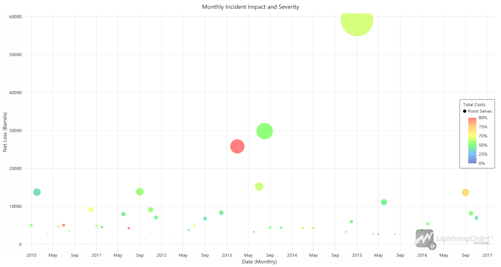

### **Monthly Costs by Category (Line Chart)**: 

Tracks monthly costs in various categories, enabling budget adjustments based on cost trends.

#### Script Summary:
```python
data = pd.read_csv('Dataset/database.csv')
data['Accident Date/Time'] = pd.to_datetime(data['Accident Date/Time'], format='%m/%d/%Y %H:%M')
data['relative_month'] = ((data['Accident Date/Time'].dt.year - 2010) * 12 + data['Accident Date/Time'].dt.month - 1)

monthly_costs = data.groupby('relative_month').agg({
    'Emergency Response Costs': 'sum',
    'Environmental Remediation Costs': 'sum',
    'Property Damage Costs': 'sum',
    'Lost Commodity Costs': 'sum',
    'Public/Private Property Damage Costs': 'sum',
    'All Costs': 'sum'
}).reset_index()

start_date = datetime(2010, 1, 1)
monthly_costs['timestamp'] = [(start_date + timedelta(days=month * 30)).timestamp() * 1000 for month in monthly_costs['relative_month']]

chart = lc.ChartXY(theme=lc.Themes.White, title="Monthly Sum Costs by Category")
categories = [('Emergency Response Costs', 'yellow', 'Emergency'),
    ('Environmental Remediation Costs', 'green', 'Environment'),
    ('Property Damage Costs', 'blue', 'Property'),
    ('Lost Commodity Costs', 'red', 'Commodity'),
    ('Public/Private Property Damage Costs', 'cyan', 'Public/Private Prop.'),
    ('All Costs', 'black', 'All')]

for category, color, label in categories:
    series = chart.add_line_series(data_pattern='ProgressiveX').set_name(label).set_line_thickness(2)
    series.add(monthly_costs['timestamp'].tolist(), monthly_costs[category].tolist())
    chart.add_legend().add(series)

chart.get_default_x_axis().set_title('Month (DateTime)').set_tick_strategy('DateTime')
chart.get_default_y_axis().set_title('Sum Cost ($Millions)')
chart.open()
```
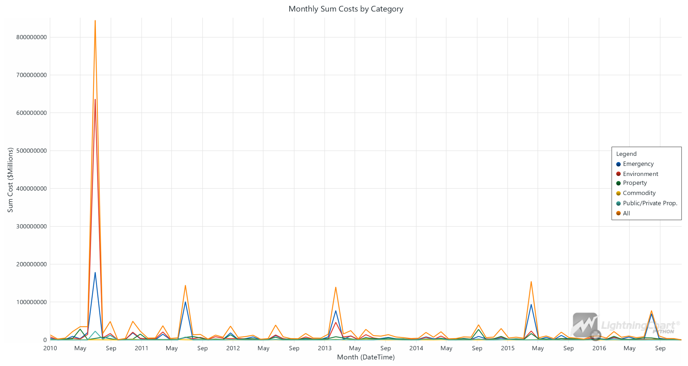

### **Incident Frequency vs. Liquid Recovery (Dual Axis Chart)**: 

Compares incident frequency and recovery rates, evaluating recovery efficiency and response strategies.

#### Script Summary:
```python
data = pd.read_csv('Dataset/database.csv')
data['Accident Date/Time'] = pd.to_datetime(data['Accident Date/Time'])
data['year_month'] = data['Accident Date/Time'].dt.to_period('M')

monthly_recovery = data.groupby('year_month')['Liquid Recovery (Barrels)'].sum().reset_index()
monthly_recovery['timestamp'] = [int(datetime(year.year, year.month, 1).timestamp()) * 1000 for year in monthly_recovery['year_month']]
x_values = monthly_recovery['timestamp'].tolist()
y_values_recovery = monthly_recovery['Liquid Recovery (Barrels)'].tolist()

monthly_incidents = data.groupby('year_month').size().reset_index(name='incident_count')
y_values_incidents = monthly_incidents['incident_count'].tolist()

chart = lc.ChartXY(theme=lc.Themes.Dark, title="Incidents Over Time vs Liquid Recovery")
x_axis = chart.get_default_x_axis().set_title("Incident Date").set_tick_strategy('DateTime', utc=True)
y_axis_left = chart.get_default_y_axis().set_title("Number of Incidents")
y_axis_right = chart.add_y_axis(opposite=True).set_title("Liquid Recovery (Barrels)")

incident_series = chart.add_line_series().set_name("Incident Frequency").add(x_values, y_values_incidents).set_line_color(lc.Color(255, 255, 0))
recovery_series = chart.add_area_series(y_axis=y_axis_right).set_name("Liquid Recovery (Barrels)").add(x_values, y_values_recovery)
recovery_series.set_fill_color(lc.Color(0, 128, 255, 128))

legend = chart.add_legend().add(incident_series).add(recovery_series).set_margin(70)
chart.open()
```
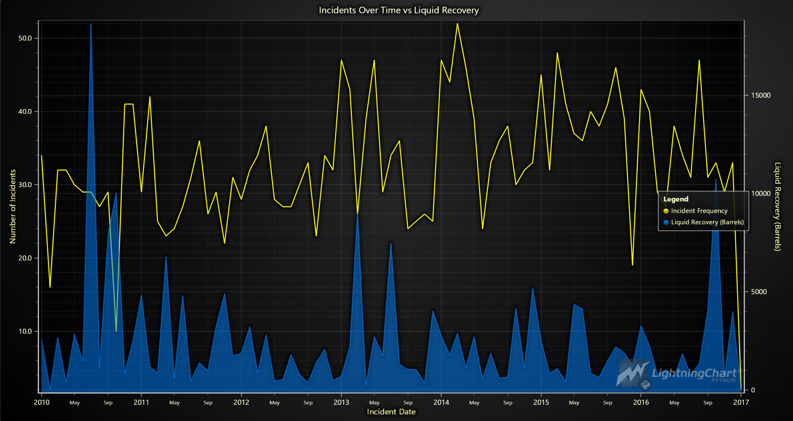

### **Incident Frequency, Recovery Rate, and Severity Levels (Multi-Dimensional Analysis)**: 

Shows frequency, recovery rate, and severity levels over time, illustrating improvements in safety measures.

#### Script Summary:
```python
data = pd.read_csv('Dataset/database.csv')
data['Accident Date/Time'] = pd.to_datetime(data['Accident Date/Time'])
data['Year'] = data['Accident Date/Time'].dt.year
data['Severity Level'] = pd.cut(data['Unintentional Release (Barrels)'], bins=[0, 50, 200, np.inf], labels=['Minor', 'Moderate', 'Severe'])

incident_counts = data.groupby('Year').size()
avg_recovery_rate = data.groupby('Year')['Liquid Recovery (Barrels)'].mean()
severity_counts = data.groupby(['Year', 'Severity Level']).size().unstack(fill_value=0)
timestamps = [int(datetime(year, 1, 1).timestamp() * 1000) for year in incident_counts.index]
severity_proportions = severity_counts.div(severity_counts.sum(axis=1), axis=0)

chart = lc.ChartXY(theme=lc.Themes.Dark, title="Incident Frequency and Average Recovery Rate Over Time")
incident_series = chart.add_point_line_series().set_name("Incident Frequency").set_line_color(
    lc.Color('yellow')).add(x=timestamps, y=incident_counts.values.tolist())

y_axis_right_1 = chart.add_y_axis(opposite=True).set_title("Average Recovery Rate (Barrels)")
recovery_series = chart.add_point_line_series(y_axis=y_axis_right_1).set_name(
    "Average Recovery Rate").set_line_color(lc.Color(0, 255, 0)).add(x=timestamps, y=avg_recovery_rate.values.tolist())

y_axis_right_2 = chart.add_y_axis(opposite=True).set_title("Proportion of Incidents by Severity")
severity_colors = {'Minor': lc.Color(135, 206, 235, 128), 'Moderate': lc.Color(255, 160, 122, 128), 'Severe': lc.Color(144, 238, 144, 128)}
for level in severity_proportions.columns:
    chart.add_area_series(y_axis=y_axis_right_2).set_name(level).set_fill_color(
        severity_colors[level]).add(x=timestamps, y=severity_proportions[level].values.tolist())

chart.get_default_x_axis().set_title("Year").set_tick_strategy("DateTime")
chart.add_legend().add(incident_series).add(recovery_series).set_margin(140)
chart.open()
```
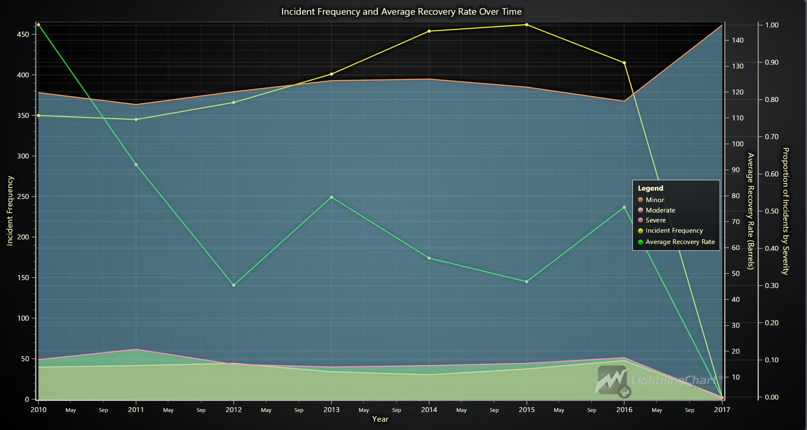

### **Seasonal Trend Analysis of Log-Normalized Incident Costs (Box Plot with Trend Line)**: 

Displays monthly cost distributions with a trend line, showing seasonal patterns in costs. Log-normalization enables better visualization, particularly for months with high variations.

#### Script Summary:
```python
data = pd.read_csv('Dataset/database.csv')
data['Accident Date/Time'] = pd.to_datetime(data['Accident Date/Time'])
data['Year'], data['Month'] = data['Accident Date/Time'].dt.year, data['Accident Date/Time'].dt.month

monthly_data = data.groupby(['Year', 'Month']).agg({'All Costs': 'sum'}).reset_index()
monthly_data['Log Normalized Costs'] = np.log1p(monthly_data['All Costs'])
monthly_data['Log Normalized Costs'] = (monthly_data['Log Normalized Costs'] - monthly_data[
    'Log Normalized Costs'].min()) / (monthly_data['Log Normalized Costs'].max() - monthly_data['Log Normalized Costs'].min())

log_normalized_stats = monthly_data.groupby('Month')['Log Normalized Costs'].describe(percentiles=[
    0.25, 0.5, 0.75]).rename(columns={'25%': 'Lower Quartile', '50%': 'Median', '75%': 'Upper Quartile', 'min': 'Lower Extreme', 'max': 'Upper Extreme'})

box_data = [{'start': m - 0.4, 'end': m + 0.4, 'median': s['Median'], 'lowerQuartile': s['Lower Quartile'],
              'upperQuartile': s['Upper Quartile'], 'lowerExtreme': s['Lower Extreme'], 'upperExtreme': s['Upper Extreme']} for m, s in log_normalized_stats.iterrows()]

chart = lc.ChartXY(theme=lc.Themes.Light, title="Seasonal Trend Analysis of Log-Normalized Incident Costs")
chart.add_box_series().set_name("Monthly Log-Normalized Cost Distribution").add_multiple(box_data)

line_series = chart.add_point_line_series().set_name("Average Log-Normalized Monthly Cost Trend").set_line_color(lc.Color(255, 0, 0))
line_series.add(x=np.arange(1, 13).tolist(), y=monthly_data.groupby('Month')['Log Normalized Costs'].mean().tolist())

chart.get_default_x_axis().set_title("Month").set_interval(0.5, 12.5).set_tick_strategy('Empty')
for i, month_name in enumerate(["Jan", "Feb", "Mar", "Apr", "May", "Jun", "Jul", "Aug", "Sep", "Oct", "Nov", "Dec"], start=1):
    chart.get_default_x_axis().add_custom_tick().set_value(i).set_text(month_name)

chart.get_default_y_axis().set_title("Log-Normalized Cost (0 to 1)")
chart.add_legend().add(chart.get_series_by_name("Monthly Log-Normalized Cost Distribution")).add(line_series)
chart.open()
```
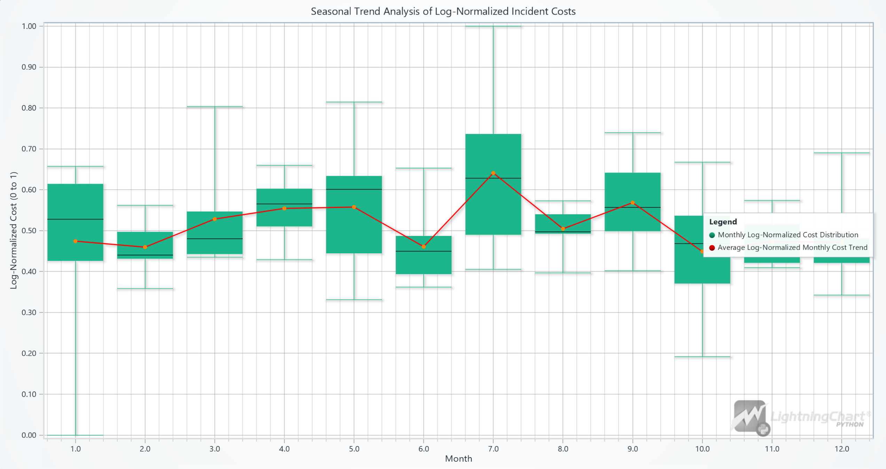

### **Comprehensive Incident and Cost Analysis (Multi-Chart Dashboard)**: 

A dashboard combining a stacked area chart, radar chart, heatmap, and gauge chart, providing a holistic view of pipeline metrics, cost distributions, and recovery rates.

#### Script Summary:
```python
data = pd.read_csv('Dataset/database.csv')
data['Accident Date/Time'] = pd.to_datetime(data['Accident Date/Time'])
data['Year'] = data['Accident Date/Time'].dt.year
historical_min, historical_max = data[['Unintentional Release (Barrels)', 'Liquid Recovery (Barrels)', 'Net Loss (Barrels)',
                                        'All Costs']].min(), data[['Unintentional Release (Barrels)', 'Liquid Recovery (Barrels)', 'Net Loss (Barrels)', 'All Costs']].max()
encoder = OneHotEncoder(sparse_output=False, handle_unknown='ignore').fit(data[['Pipeline Type', 'Cause Category']])

X = np.hstack((data[['Unintentional Release (Barrels)', 'Liquid Recovery (Barrels)', 'Net Loss (Barrels)']], encoder.transform(data[['Pipeline Type', 'Cause Category']])))
y = data['All Costs']
model = RandomForestRegressor(n_estimators=100, random_state=42, n_jobs=-1).fit(X, y)
scaler = MinMaxScaler((0, 10)).fit(data[['Unintentional Release (Barrels)', 'Liquid Recovery (Barrels)', 'Net Loss (Barrels)', 'All Costs']])

dashboard = lc.Dashboard(theme=lc.Themes.TurquoiseHexagon, rows=2, columns=3)
stacked_area_chart = dashboard.ChartXY(row_index=0, column_index=0, column_span=2, title="Annual Analysis")
series_dict = {m: stacked_area_chart.add_area_series(data_pattern='ProgressiveX').set_name(m) for m in ['Incidents', 'Liquid Recovery', 'Net Loss', 'All Costs']}
recovery_gauge = dashboard.GaugeChart(row_index=1, column_index=2, title='Recovery Rate (%)')
spider_chart = dashboard.SpiderChart(row_index=0, column_index=2, title='Incident Metrics')
heatmap = dashboard.ChartXY(row_index=1, column_index=0, column_span=2).add_heatmap_grid_series(rows=100, columns=100)

def update_dashboard():
    for year in range(2010, 2028):
        if year > 2017:
            synthetic_data = pd.DataFrame({f: np.random.uniform(historical_min[f], historical_max[f], 50) for f in
                                            ['Unintentional Release (Barrels)', 'Liquid Recovery (Barrels)', 'Net Loss (Barrels)']})
            X_future = np.hstack((synthetic_data[['Unintentional Release (Barrels)', 'Liquid Recovery (Barrels)', 'Net Loss (Barrels)']],
                                   encoder.transform([[data[['Pipeline Type', 'Cause Category']].mode().iloc[0].tolist()]] * 50)))
            all_costs_pred = model.predict(X_future).sum()
            incidents, liquid_recovery, net_loss = 300, synthetic_data['Liquid Recovery (Barrels)'].sum(), synthetic_data['Net Loss (Barrels)'].sum()
        else:
            year_data = data[data['Year'] == year]
            incidents, liquid_recovery, net_loss, all_costs_pred = year_data.shape[0], year_data['Liquid Recovery (Barrels)'].sum(),
            year_data['Net Loss (Barrels)'].sum(), year_data['All Costs'].sum()

        values = scaler.transform([[incidents, liquid_recovery, net_loss, all_costs_pred]]).flatten()
        year_timestamp = int(datetime(year, 1, 1).timestamp() * 1000)
        for m, v in zip(series_dict.keys(), values):
            series_dict[m].add([year_timestamp], [v])

        recovery_gauge.set_value((liquid_recovery / (liquid_recovery + net_loss)) * 100 if incidents > 0 else 0)
        heatmap.invalidate_intensity_values(np.histogram2d(synthetic_data['Accident Longitude'], synthetic_data['Accident Latitude'], 
                                                           bins=[100, 100], weights=synthetic_data['All Costs']).tolist())

        time.sleep(3)
dashboard.open(live=True)
update_dashboard()
```


## Conclusion

In summary, oil and gas data analysis provides vital insights that improve safety, reduce costs, and optimize operations in pipeline monitoring. Leveraging LightningChart Python, we can create an interactive real-time dashboard, geospatial analyses, and predictive models to track, predict, and respond to incidents. By implementing this data-driven approach, companies gain a comprehensive understanding of pipeline health, enabling proactive management and swift responses to potential issues.

Using LightningChart Python for oil and gas data visualization not only enhances decision-making but also aligns with industry goals to improve environmental responsibility and operational efficiency.

## Benefits of Using LightningChart Python for Visualizing Data

1. **High-Performance Rendering**: LightningChart is built to handle large datasets efficiently, making it ideal for real-time data monitoring and analysis. In the oil and gas industry, where data is generated at high volumes from sensors, monitoring equipment, and operational logs, LightningChart’s capability to process and render data without lag ensures smooth, interactive experiences for analysts and decision-makers.
2. **Rich Selection of Chart Types**: With a wide range of chart options, including line charts, heatmaps, radar charts, bubble charts, box plots, and area charts, LightningChart Python enables users to visualize data in diverse ways. This variety allows for customized data presentations tailored to specific analytical needs, from incident frequency tracking to cost impact visualization, giving analysts a versatile toolset to explore insights.
3. **Real-Time Data Visualization**: Real-time monitoring is critical for pipeline incident detection and proactive maintenance. LightningChart’s real-time dashboard capabilities allow for continuous data updates, which is essential in tracking pipeline integrity, liquid recovery efforts, and overall operational health. Real-time alerts and visual feedback enable swift responses to emerging issues, reducing downtime and mitigating risks.
4. **Scalability and Flexibility**: LightningChart is highly scalable and can adapt to different data requirements, from small-scale projects to industry-wide analyses. Whether visualizing data for a single pipeline or analyzing hundreds of miles of infrastructure, LightningChart can handle it efficiently. Its flexibility also allows analysts to add or remove data points, adjust metrics, and switch between chart types seamlessly, supporting both exploratory and deep-dive analysis.
5. **Customizable Visualizations**: Customization options in LightningChart enable precise adjustments to visual elements like colors, legends, labels, and axes. This allows analysts to create intuitive, visually appealing charts that are easy to interpret and tailor-made for the audience's needs, whether technical teams, safety officers, or executive decision-makers. Additionally, customization enhances storytelling, ensuring each chart conveys its intended message clearly.
6. **Advanced Data Interactivity**: LightningChart provides interactive features such as zooming, panning, tooltips, and data point selection, enhancing the exploration process. This interactivity is invaluable when working with geospatial heatmaps, incident timelines, or multi-dimensional radar charts, as it allows users to engage with the data dynamically, facilitating a deeper understanding of trends, patterns, and anomalies.
7. **Streamlined Data Integration**: LightningChart integrates smoothly with popular Python data libraries like Pandas and NumPy, making it easier to load, process, and visualize data within a cohesive workflow. This streamlined integration is essential for data-driven pipelines, where multiple analyses and visualizations are often performed in sequence, supporting efficient data management and consistent insights.
8. **Supports Predictive Analysis and Machine Learning**: With its compatibility with Python’s machine learning ecosystem, LightningChart can display predictive model results and forecasts alongside historical data. This is especially useful for analyzing trends like pipeline aging effects, incident likelihoods, and cost forecasts, providing valuable information to guide maintenance planning and risk mitigation strategies.(LightningChart® Python Charts for Data Visualization, 2024)


## References

- Data analysis of Pipeline Accidents. (n.d.). Retrieved October 15, 2024, from https://kaggle.com/code/eivindstroemsvaag/data-analysis-of-pipeline-accidents
- Hussain, M., Zhang, T., & Seema, M. (2023). Adoption of big data analytics for energy pipeline condition assessment—A systematic review. International Journal of Pressure Vessels and Piping, 206, 105061. https://doi.org/10.1016/j.ijpvp.2023.105061
- LightningChart® Python charts for data visualization. (2024, March 7). https://lightningchart.com/python-charts/
- LightningChart Python API Reference. (n.d.). Retrieved May 31, 2024, from https://lightningchart.com/python-charts/api-documentation/
- Positioning for green: Oil and gas business in a low-carbon world. (n.d.). Deloitte Insights. Retrieved October 15, 2024, from https://www2.deloitte.com/us/en/
